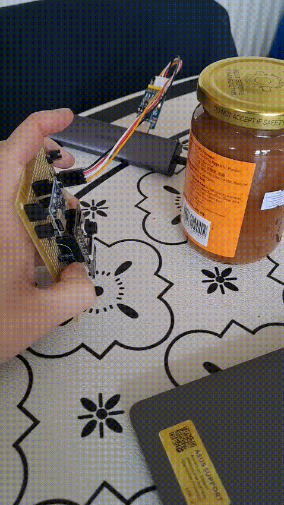
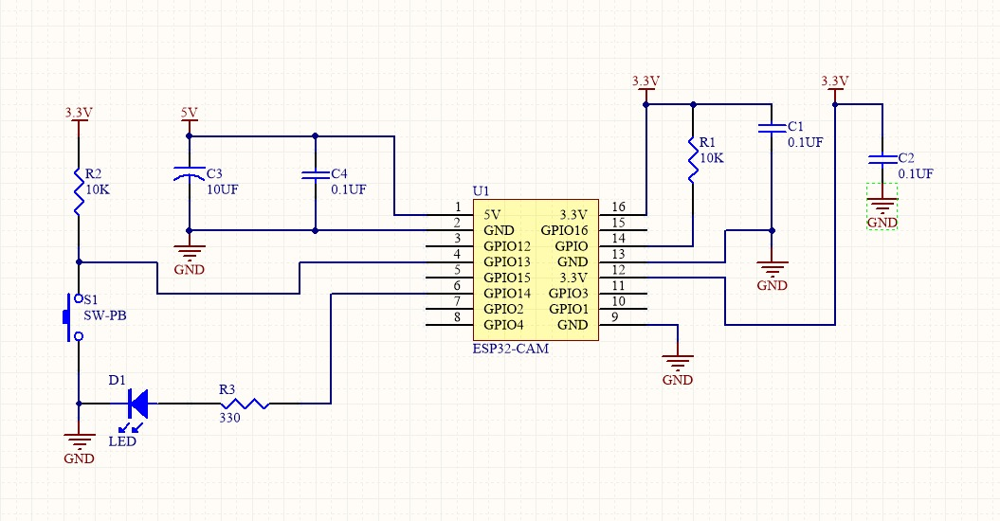
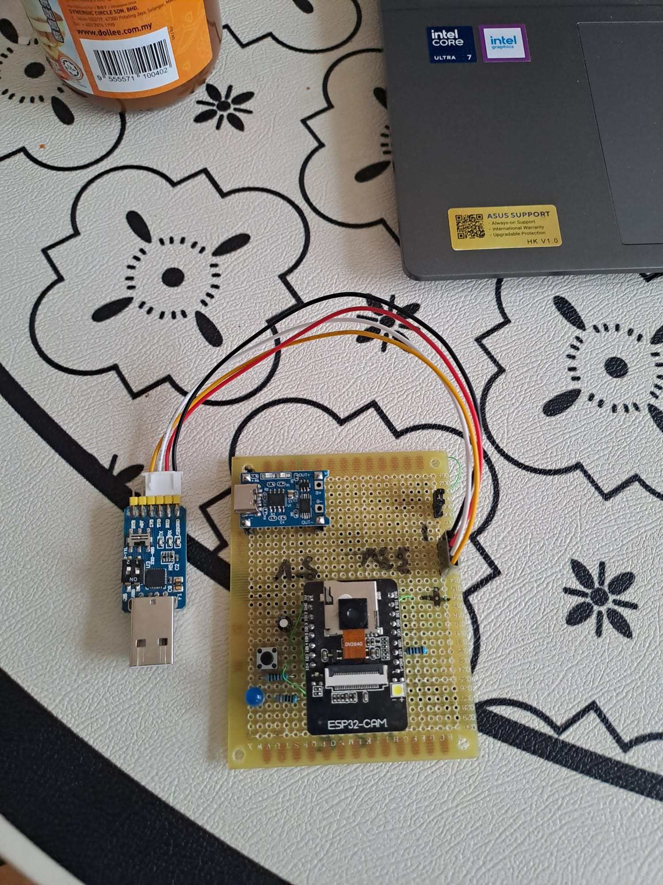
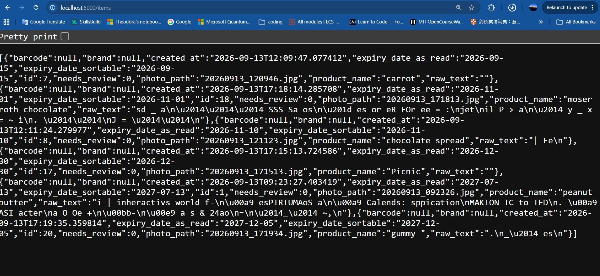
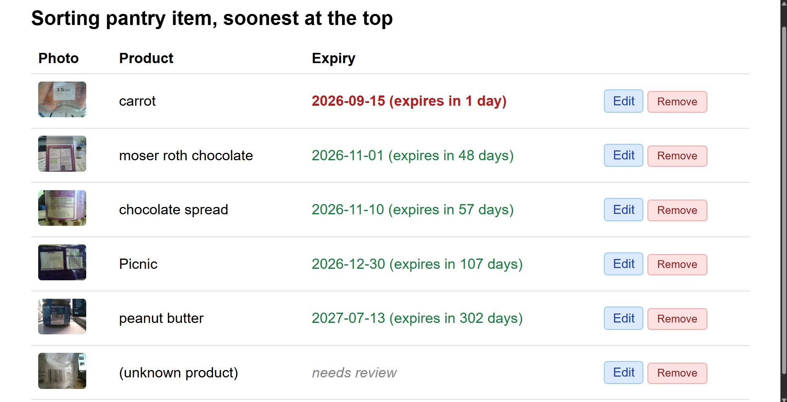
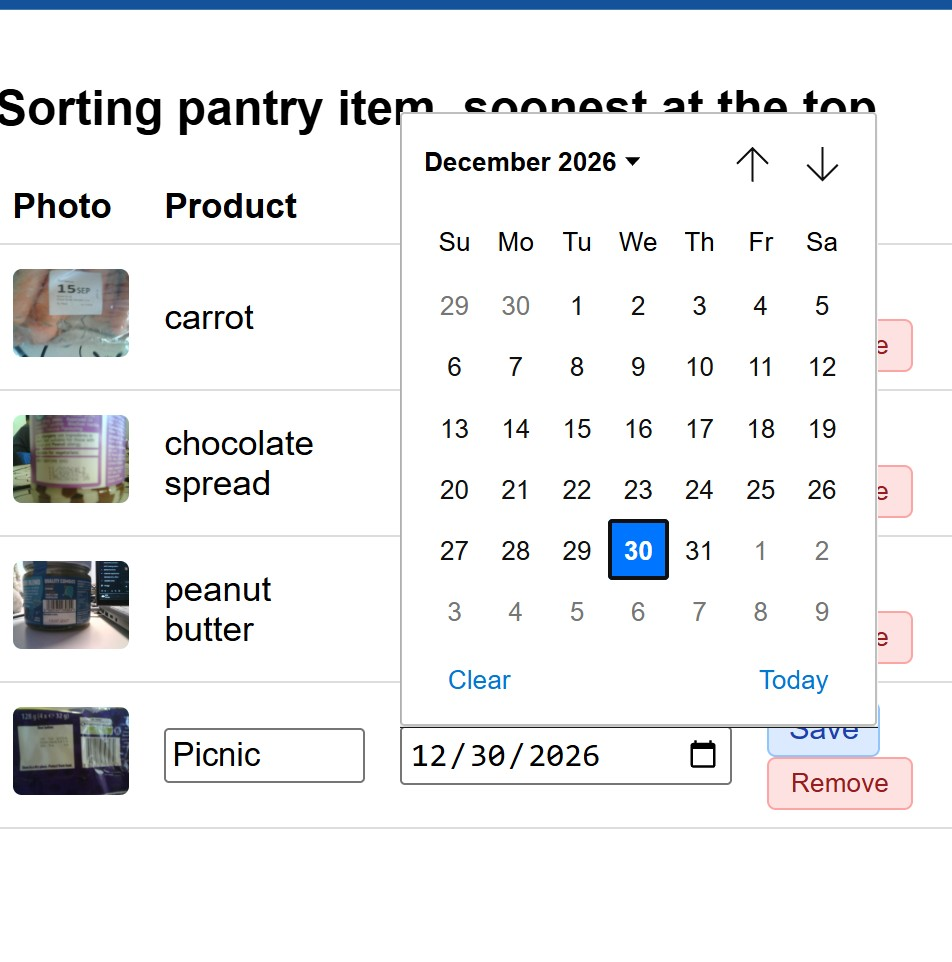

# Pantry Scanner
A camera-based scanner automatically read the expiry date where possible, and label thing from soonest expire on a dashboard
## Idea:
A lot of people end up throwing away food that's gone off simply because they forgot it was in the pantry. It gets pushed to the back of a shelf out of sight and by the time it is found, it is already past its expiration date.
Pantry Scanner is meant to make it easy to keep track of what you have. Point the camera at a produce take a picture, write down what is it and when it expires. Either automatically where the camera can read it or manually typing if it can't. The dashboard always shows the items that are going to expire the soonest first. 

## How this work
1. Press a physical button on an ESP32-CAM device
2. It capture a photo and sends it over through WI-Fi to backend 
3. The backend reads any printed text on the label using OCR and tries to find an expiry date in it. It also attempt to read a barcode.
4. Everything is saved to a local database and shown on a dashboard, sorted with the soonest-expiring item at the top
5. Anything the system couldn't figure out automatically can be filled in by hand through the edit button, use remove button to delete a mistaken or finished item .

## Component on hardware:
-- AI thinker ESP32-CAM board 
-- ESP32-CAM-MB adapter, this is for programming, as the board has no onboard USB
--push button which capture the trigger
--status LED
--resistors and capacitors.

## Component on Software:
-- C++ on ESP32-Core
-- Python on backend, it also run by flask, this allow running without external cloud account, it also use pytesseract for reading text label, pyzbar for barcode decoding, SQLite for storage, and Open food facts API for product lookup when a barcode is successfully reading
--dashboard:plain HTML /CSS served by Flask (http://localhost:5000/dashboard)
-- data endpoint: same data in the dashboard, but it is in a raw form, 
(http://localhost:5000/items)
## SetUp
### Backend:
1. install Tesseract OCR on your computer
2. in terminal type: pip install flask pytesseract pyzbar pillow requests
3. Update the tesseract_cmd path near the top of app.py to match where Tesseract installed on your system.
4. python app.py to start the server on port 5000
5. Open http://localhost:5000/dashboard in a browser.

### Hardware:
1. open the ino.file in arduino IDE
2. Board "AI thinker ESP32-CAM"
3. Change the WI-FI location and passwords to match with your local computer
4. upload from the adapter and reset the AI thinker board. 

## dashboard:
The dashboard shows 4 things per item: a photo (what the camera captured), the product name (entered manually via Edit — never read
automatically), the barcode, and the expiry date.
The expiry column shows the date plus a plain-language description next to it (e.g. "expires in 5 days" or "expired 3 days ago"), colour-coded three ways:
- Red: expiring within 7 days
- Green: expiring in more than 7 days
- Grey italics: no date known yet ("needs review")
Each row also has Edit(fill in or correct the product name/expiry by
hand) and Remove(delete the row and its photo) buttons.

## Files:
### PCB: 
This file only contain schematic file due to I already had all the physcial components, so I bypassed the custom PCB phase and built the circuit directly on a prototype board. I create the schematic beforehand simply to map out the connections, ensure the external adapter intergration was correct and keep a clean record of the wiring logic
### arduino:
This file contains the back-end essest, it use C++ code running on the ESP32-cam. This allow the ESP32 to serve the user interface directly to a browser and instantly process HTTP request on localfile to control the camera.
### Smart Recipe: 
This is a folder contain style.css which under the static folder, index.html and app.py.It also have a photos folder(which is the place where it will save the photo from the camera). Also, the pantry.db. The database which store the localfile. The program now only can run in local host 

## Limiation:
1. Barcode decoding is unrealiable, it occasionally works but it cannot depend on it due to the camera quality. I have try to different method to make the camera focus at a single point but it doesn't work, it always cause blur, lighting issue 
2. OCR only work best on large, bold, clear text, small print is hard for the camera to capture which will often need manually entry
3. Product name never read automatically due to all the product that I have been tested on, the expiry date and produce name are on different side
4. Quality of camera, this ESP32-cam has a fixed focus, and low-light performance which is struggle to recognize things

## Next Steps:
1. Use a dedicated barcode-scanner instead of relying on the camera 
2. Create a fixed scanning stand using 3D printing, for more consistent capture quality than hand positioning.
3. Attach a macro lens attachement for the camera to improve small print in OCR

## AI Usage:
AI is used in debugging and diagnosis the actual bug on the camera, it also aid in writing the backend app.py.
